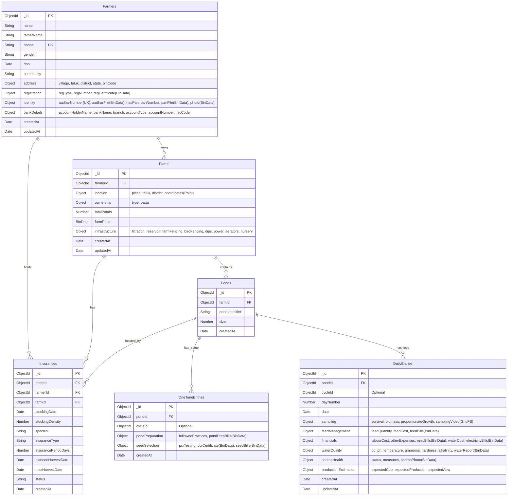

```mermaid
erDiagram
    Farmers ||--o{ Farms : "owns"
    Farmers ||--o{ Insurances : "holds"
    Farms ||--o{ Ponds : "contains"
    Farms ||--o{ Insurances : "has"
    Ponds ||--o{ Insurances : "insured_by"
    Ponds ||--o{ OneTimeEntries : "has_setup"
    Ponds ||--o{ DailyEntries : "has_logs"

    Farmers {
        ObjectId _id PK
        String name
        String fatherName
        String phone UK
        String gender
        Date dob
        String community
        Object address "village, taluk, district, state, pinCode"
        Object registration "regType, regNumber, regCertificate(BinData)"
        Object identity "aadharNumber(UK), aadharFile(BinData), hasPan, panNumber, panFile(BinData), photo(BinData)"
        Object bankDetails "accountHolderName, bankName, branch, accountType, accountNumber, ifscCode"
        Date createdAt
        Date updatedAt
    }

    Farms {
        ObjectId _id PK
        ObjectId farmerId FK
        Object location "place, taluk, district, coordinates(Point)"
        Object ownership "type, patta"
        Number totalPonds
        BinData farmPhoto
        Object infrastructure "filtration, reservoir, farmFencing, birdFencing, dips, power, aerators, nursery"
        Date createdAt
        Date updatedAt
    }

    Ponds {
        ObjectId _id PK
        ObjectId farmId FK
        String pondIdentifier
        Number size
        Date createdAt
    }

    Insurances {
        ObjectId _id PK
        ObjectId pondId FK
        ObjectId farmerId FK
        ObjectId farmId FK
        Date stockingDate
        Number stockingDensity
        String species
        String insuranceType
        Number insurancePeriodDays
        Date plannedHarvestDate
        Date maxHarvestDate
        String status
        Date createdAt
    }

    OneTimeEntries {
        ObjectId _id PK
        ObjectId pondId FK
        ObjectId cycleId "Optional"
        Object pondPreparation "followedPractices, pondPrepBills(BinData)"
        Object seedSelection "pcrTesting, pcrCertificate(BinData), seedBills(BinData)"
        Date createdAt
    }

    DailyEntries {
        ObjectId _id PK
        ObjectId pondId FK
        ObjectId cycleId "Optional"
        Number dayNumber
        Date date
        Object sampling "survival, biomass, proportionateGrowth, samplingVideo(GridFS)"
        Object feedManagement "feedQuantity, feedCost, feedBills(BinData)"
        Object financials "labourCost, otherExpenses, miscBills(BinData), waterCost, electricityBills(BinData)"
        Object waterQuality "do, ph, temperature, ammonia, hardness, alkalinity, waterReport(BinData)"
        Object shrimpHealth "status, measures, shrimpPhoto(BinData)"
        Object productionEstimation "expectedCop, expectedProduction, expectedAbw"
        Date createdAt
        Date updatedAt
    }
```
